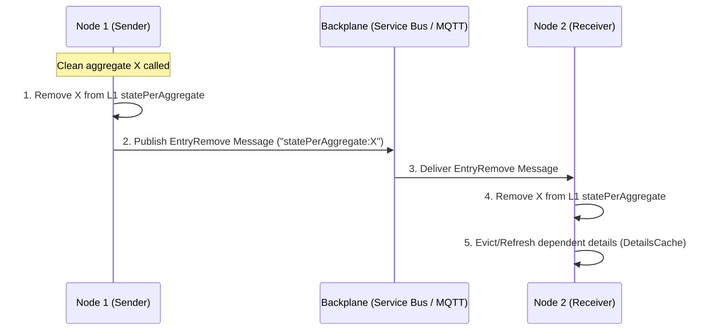
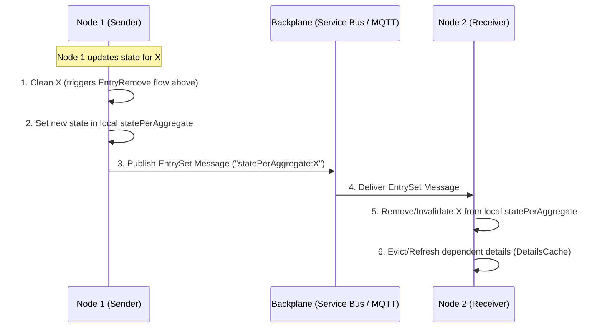

# Aggregate Invalidation & L2 Cache Flow Report

This report outlines the mechanisms behind aggregate cache invalidation, details the role of the L2 SQL Cache, and summarizes what is (and isn't) stored in L2, providing a big-picture overview of the Sharpino cache architecture.

---

## 1. Aggregate Cache Invalidation & Update Flows

When an aggregate is modified or updated on a node, there are two distinct backplane message types that trigger cache invalidation on peer nodes: **EntryRemove** (eviction) and **EntrySet** (state update).

### Flow A: Explicit Eviction / Clean (EntryRemove)
When an aggregate is explicitly evicted (e.g., calling `Clean`):



### Flow B: State Update / Memoization (EntrySet)
When Node 1 produces a new event and updates its local cache (e.g., via `Memoize2` -> `TryCacheTask`):



### Flow Breakdown
1. **Local Eviction on Node 1**:
   - Node 1 calls `Clean` on `AggregateCache3.Instance` for aggregate ID `X`.
   - Node 1 removes `X` from its internal L1 cache (`statePerAggregate`) and its LRU tracking.
2. **Backplane Notification**:
   - Node 1 broadcasts a `BackplaneMessage.CreateForEntryRemove` message with the key `"statePerAggregate:X"` over the backplane.
3. **Local State Update on Node 1**:
   - When a new event is processed, `Memoize2` caches the new state via `TryCacheTask`.
   - `TryCacheTask` sets the new Task in Node 1's local `statePerAggregate` and broadcasts a `BackplaneMessage.CreateForEntrySet` message.
4. **Invalidation & Refresh on Node 2**:
   - Node 2 receives the backplane message (`EntryRemove` or `EntrySet`) via `statePerAggregate.Events.Backplane.add_MessageReceived`.
   - Because the task itself cannot be sent across the wire, Node 2 handles **both** `EntryRemove` and `EntrySet` actions by invalidating (removing) its local cache entry for that aggregate key:
     ```fsharp
     statePerAggregate.Remove(key, receiverOptions)
     ```
   - Node 2 then parses the key as a Guid (`X`) and triggers a refresh on dependent details:
     ```fsharp
     DetailsCache.Instance.RefreshDependentDetailsAsync(guidKey, Some CancellationToken.None) |> ignore
     ```
   - This in turn executes `RefreshAsync` on all detail items associated with aggregate `X`, ensuring that read-model projections/details are immediately re-cached or updated.

---

## 2. Involvement of L2 Cache in Aggregate Cache

> [!IMPORTANT]
> **The L2 Cache is NOT involved in the aggregate cache (`AggregateCache3`) flow.**

A cache miss on the aggregate cache (`statePerAggregate`) for any object **cannot** use the L2 cache as a fallback. 
- In `AggregateCache3.SetupL2AndBackplane`, the initialization of the L2 distributed cache is explicitly commented out:
  ```fsharp
  // We do NOT configure L2 Cache because this cache stores Task objects which cannot be serialized
  // if dc.IsSome && ser.IsSome then
  //     (statePerAggregate :> IFusionCache).SetupDistributedCache(dc.Value, ser.Value) |> ignore
  ```
- Because it stores `Task<Result<EventId * obj, string>>` objects (runtime concurrency tasks returning arbitrary state objects), it is fundamentally incompatible with standard L2 serialization.

### Rebuilding Aggregate State
Instead of using L2 cache, aggregate state reconstruction relies on:
1. **Event Replay**: Re-reading events from the event store.
2. **Database Snapshots**: Rebuilding is kept highly efficient by loading the latest **snapshot** from the database (e.g. the `snapshots` table in PostgreSQL) and applying only the events occurring *after* that snapshot.

---

## 3. L2 Cache Contents: What is and isn't stored?

Below is a breakdown of the caches managed in `Cache.fs` and their L2 cache eligibility:

| Cache Component | Purpose | Stored in L1? | Stored in L2? | Why / Why Not? |
| :--- | :--- | :---: | :---: | :--- |
| **`objectDetailsAssociationsCache`** | Maps aggregate IDs to lists of details keys (`List<DetailsCacheKey>`). | **Yes** | **Yes** | It contains only plain list/GUID string combinations which are fully JSON-serializable. |
| **`statesDetails`** | Caches the actual projected/memoized detail values. | **Yes** | **No** | It caches `RefreshableAsync<'T>` wrappers. These wrappers capture F# live closures and reference types (e.g., `System.Type`), which throw serialization exceptions. |
| **`statePerAggregate`** | Caches the reconstructed aggregate states. | **Yes** | **No** | It stores `Task` objects representing the asynchronous state reconstruction, which cannot be serialized. |

---

## 4. Big Picture: Storing Information in L2 Cache

### Stored in L2 Cache
- **Entity/Aggregate-to-Details associations** (`objectDetailsAssociationsCache`).
- *Note: While the projected details themselves (in `statesDetails`) cannot be stored in L2 because of the wrapper closures, the associations are stored, allowing nodes to quickly identify which projections need to be invalidated or updated.*

### Rebuilding vs Caching State
- **Rebuilding is costly**: Replaying thousands of events is slow.
- **The Snapshot fallback**: To mitigate the absence of L2 caching for aggregate state, Sharpino uses DB-backed snapshots.
- **Why not store aggregate state in L2?**
  1. Caching live `Task` objects in L1 is great for avoiding redundant concurrently running rebuilds, but Tasks can't cross process boundaries (L2).
  2. Aggregate states can be complex, deeply nested, or dynamic. Serializing them directly to JSON for L2 cache might introduce schema-drift or versioning issues upon node restarts.
  3. The DB-backed snapshot system already functions as a persistent, transaction-safe "L2 cache" for aggregate states, making an additional SQL-based L2 cache redundant for this specific data.
