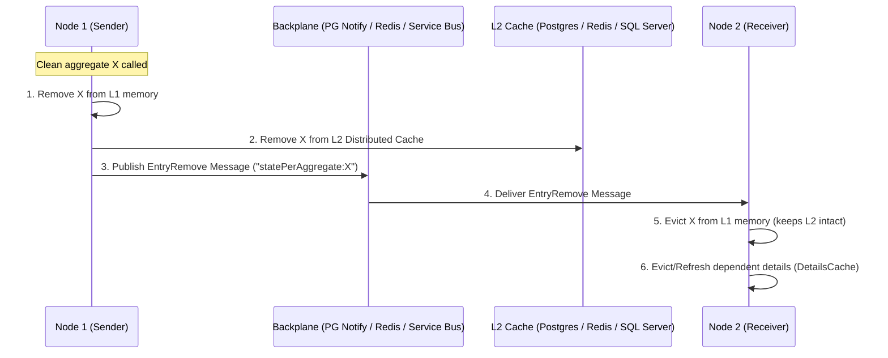
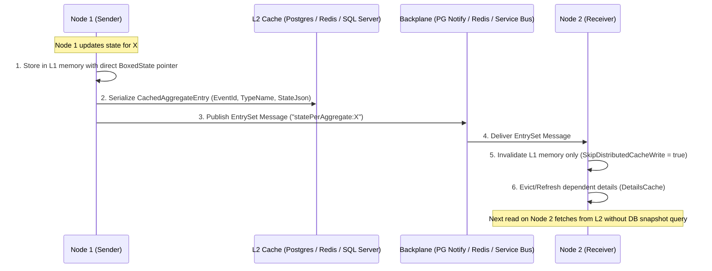

# Aggregate Invalidation & L2 Cache Flow Report

This report outlines the mechanisms behind aggregate cache invalidation, details the role and operation of the multi-tier Level 2 (L2) Distributed Cache for `AggregateCache3`, and summarizes what is (and isn't) stored across L1 and L2 cache layers in Sharpino.

---

## 1. Aggregate Cache Invalidation & Update Flows

When an aggregate is modified or updated on a node, there are two distinct backplane message types that trigger cache actions on peer nodes: **EntryRemove** (eviction) and **EntrySet** (state update).

### Flow A: Explicit Eviction / Clean (EntryRemove)
When an aggregate is explicitly evicted (e.g., calling `Clean`):


```mermaid
sequenceDiagram
    participant Node1 as Node 1 (Sender)
    participant BP as Backplane (PG Notify / Redis / Service Bus)
    participant L2 as L2 Cache (Postgres / Redis / SQL Server)
    participant Node2 as Node 2 (Receiver)
    
    Note over Node1: Clean aggregate X called
    Node1->>Node1: 1. Remove X from L1 memory
    Node1->>L2: 2. Remove X from L2 Distributed Cache
    Node1->>BP: 3. Publish EntryRemove Message ("statePerAggregate:X")
    
    BP->>Node2: 4. Deliver EntryRemove Message
    Node2->>Node2: 5. Evict X from L1 memory (keeps L2 intact)
    Node2->>Node2: 6. Evict/Refresh dependent details (DetailsCache)
```

### Flow B: State Update / Memoization (EntrySet)
When Node 1 processes an event and records the new state (e.g., via `Memoize2`):


```mermaid
sequenceDiagram
    participant Node1 as Node 1 (Sender)
    participant L2 as L2 Cache (Postgres / Redis / SQL Server)
    participant BP as Backplane (PG Notify / Redis / Service Bus)
    participant Node2 as Node 2 (Receiver)
    
    Note over Node1: Node 1 updates state for X
    Node1->>Node1: 1. Store in L1 memory with direct BoxedState pointer
    Node1->>L2: 2. Serialize CachedAggregateEntry (EventId, TypeName, StateJson)
    Node1->>BP: 3. Publish EntrySet Message ("statePerAggregate:X")
    
    BP->>Node2: 4. Deliver EntrySet Message
    Node2->>Node2: 5. Invalidate L1 memory only (SkipDistributedCacheWrite = true)
    Node2->>Node2: 6. Evict/Refresh dependent details (DetailsCache)
    Note over Node2: Next read on Node 2 fetches from L2 without DB snapshot query
```

### Flow Breakdown
1. **Local State Update on Node 1**:
   - `Memoize2 (eventId, state) aggregateId` wraps state into a serializable `CachedAggregateEntry`:
     - `EventId`: the latest event sequence number.
     - `TypeName`: assembly-qualified type name.
     - `StateJson`: JSON-serialized representation of the aggregate state.
     - `BoxedState`: in-memory boxed reference (for zero-deserialization L1 access).
   - Writes to `statePerAggregate` (FusionCache). FusionCache places the object into L1 memory and serializes it to the configured L2 distributed cache provider (PostgreSQL, Redis, or SQL Server).
2. **Backplane Notification**:
   - Node 1 broadcasts a `BackplaneMessage.CreateForEntrySet` (or `CreateForEntryRemove`) message with key `"statePerAggregate:X"`.
3. **Invalidation & Refresh on Node 2**:
   - Node 2 receives the message via its backplane subscription (`Events.Backplane.add_MessageReceived`).
   - Node 2 evicts its **local L1 memory entry** using `receiverOptions`:
     ```fsharp
     opt.SkipDistributedCacheRead <- true
     opt.SkipDistributedCacheWrite <- true
     opt.SkipBackplaneNotifications <- true
     ```
     This evicts stale memory on Node 2 **without removing the valid entry from L2**.
   - Node 2 parses the aggregate ID Guid (`X`) and triggers a refresh on dependent details:
     ```fsharp
     DetailsCache.Instance.RefreshDependentDetailsAsync(guidKey, Some CancellationToken.None) |> ignore
     ```
   - Subsequent reads on Node 2 can instantly fetch the latest aggregate state from L2 rather than querying the database snapshot table.

---

## 2. Involvement of L2 Distributed Cache in `AggregateCache3`

> [!NOTE]
> **L2 Distributed Cache is fully enabled and active for `AggregateCache3`.**

### Evolution & Resolution of the Serialization Limitation
- **Historical Limitation**: Previously, `AggregateCache3` stored runtime `Task<Result<EventId * obj, string>>` objects in FusionCache. Because `Task` instances cannot be serialized across process boundaries, `SetupDistributedCache` was disabled, restricting `AggregateCache3` to a single-node in-memory cache.
- **The Solution (`CachedAggregateEntry`)**:
  ```fsharp
  [<CLIMutable>]
  type CachedAggregateEntry = {
      EventId: EventId
      TypeName: string
      StateJson: string
      [<System.Text.Json.Serialization.JsonIgnore>]
      mutable BoxedState: obj option
  }
  ```
  1. **L1 Performance**: For local cache hits, `BoxedState` holds the live aggregate object reference. Retrieving cached state executes in sub-microsecond time with **zero JSON deserialization overhead**.
  2. **L2 Multi-Node Sharing**: When written to L2, the entry cleanly serializes to PostgreSQL / Redis / SQL Server.
  3. **L2 Rehydration**: When a node cold-starts or experiences an L1 eviction, FusionCache fetches `CachedAggregateEntry` from L2. `GetState` / `GetStateAsync` lazily deserializes `StateJson` once using `TypeName`, populates `BoxedState`, and resumes fast in-memory operation.

### Read-Through Aggregate Snapshot Acceleration (`StateView`)
In `StateView.fs`, aggregate state reconstitution now benefits from multi-tier cache acceleration:
1. `getLastAggregateSnapshot` and `getLastAggregateSnapshotAsync` check `AggregateCache3.Instance.GetEntry / GetEntryAsync(aggregateId)` first.
2. If the aggregate exists in L1 or L2, `StateView` loads the cached snapshot directly:
   - Supports both `string` (JSON) and `byte[]` binary event stores via `convertStateJsonToFormat<'F>`.
3. If not found in cache, it falls back to querying the database snapshot table (`TryGetLastAggregateSnapshot`).
4. Rebuilding an aggregate requires replaying only the delta events occurring *after* the cached/persisted snapshot event ID.

---

## 3. Cache Contents Breakdown: What is and isn't stored in L2?

Below is a breakdown of the caches managed in `Cache.fs` and their multi-tier distribution:

| Cache Component | Purpose | Stored in L1? | Stored in L2? | Format / Serialization Notes |
| :--- | :--- | :---: | :---: | :--- |
| **`statePerAggregate`** (`AggregateCache3`) | Caches latest calculated aggregate states. | **Yes** | **Yes** | Uses `CachedAggregateEntry`. Holds live object reference in `BoxedState` (L1) and JSON text in `StateJson` (L2). |
| **`objectDetailsAssociationsCache`** | Maps aggregate IDs to lists of details keys (`List<DetailsCacheKey>`). | **Yes** | **Yes** | Stores plain lists of string keys; fully JSON-serializable. |
| **`statesDetails`** | Caches projected/memoized detail view values. | **Yes** | **No** | Stores `RefreshableAsync<'T>` wrappers that capture live closures and `System.Type` instances. Remains an ultra-fast L1-only cache. |

---

## 4. Big Picture: Multi-Tier Hierarchy

### The Reconstitution Cascade
When a command or query requires an aggregate's state, Sharpino evaluates the following hierarchy:

```
[1. L1 Memory Cache]  --> Sub-microsecond hit via BoxedState pointer
       ↓ (miss / cold node)
[2. L2 Distributed Cache] --> Fast hit from PostgreSQL / Redis (CachedAggregateEntry)
       ↓ (miss / expired)
[3. DB Snapshots Table]   --> Database snapshot (e.g. snapshots table)
       ↓
[4. Event Store Delta]    --> Replay only events occurring after snapshot EventId
```

### Key Operational Takeaways
1. **L2 TTL vs L1 TTL**:
   - L2 TTL is configured shorter than L1 (e.g., L2 = 120–600s, L1 = 600s) to avoid stale distributed entries polluting fresh nodes after restarts.
2. **Backplane Non-Destructive Invalidation**:
   - Backplane message handlers evict L1 memory without purging L2, maintaining cache warmth across the cluster while ensuring stale memory is discarded.
3. **Provider Flexibility**:
   - L2 Cache: PostgreSQL (`Community.Microsoft.Extensions.Caching.PostgreSql`), Redis, or SQL Server.
   - Backplane: PostgreSQL `LISTEN / NOTIFY`, Redis Pub/Sub, or Azure Service Bus.
