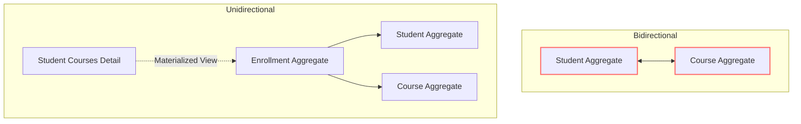
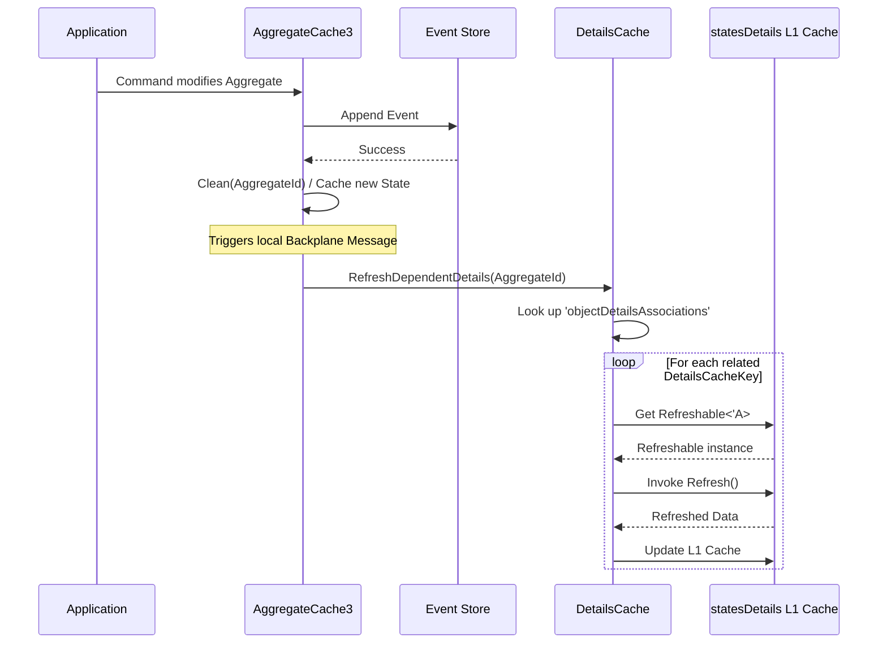
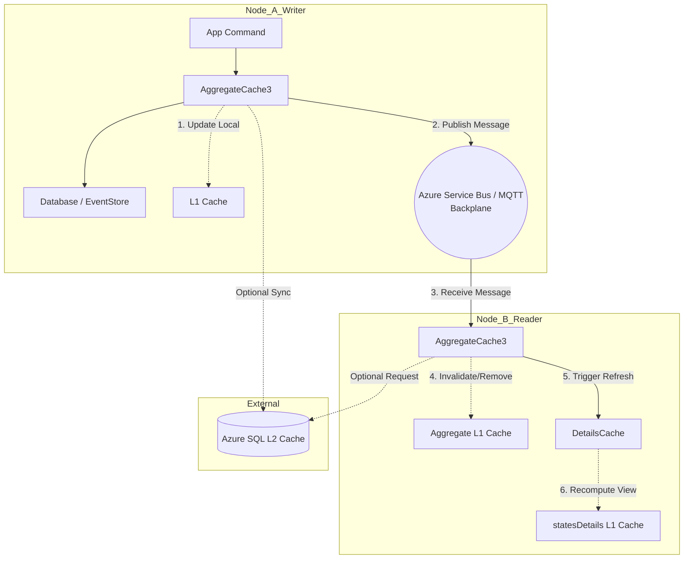

# Sharpino Caching Architecture Diagrams

These diagrams visualize the key concepts of the caching architecture in Sharpino.

## 1. Unidirectional Design vs Bidirectional

## 2. Refreshable Details Flow

This diagram shows how emitting an event triggers the dependent details to refresh.

## 3. Distributed Cache & Backplane Synchronization

This flow illustrates what happens across two distributed application nodes when an aggregate is updated.

